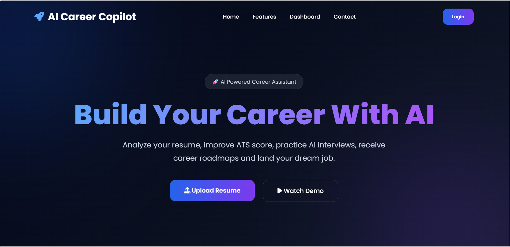
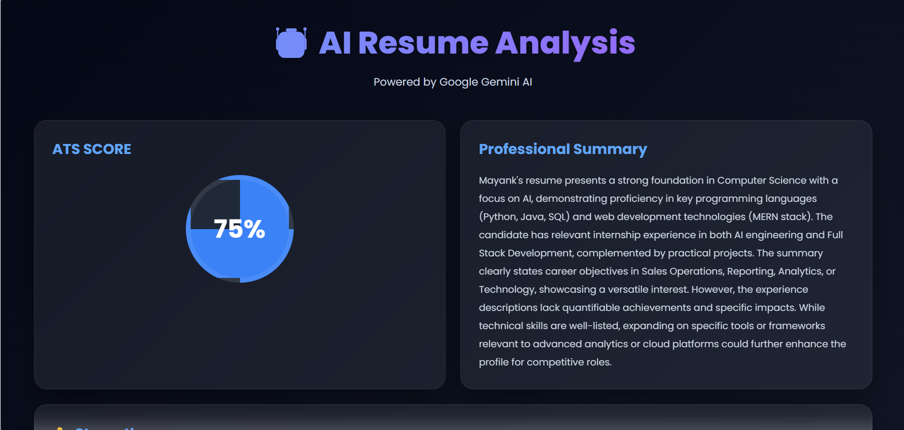
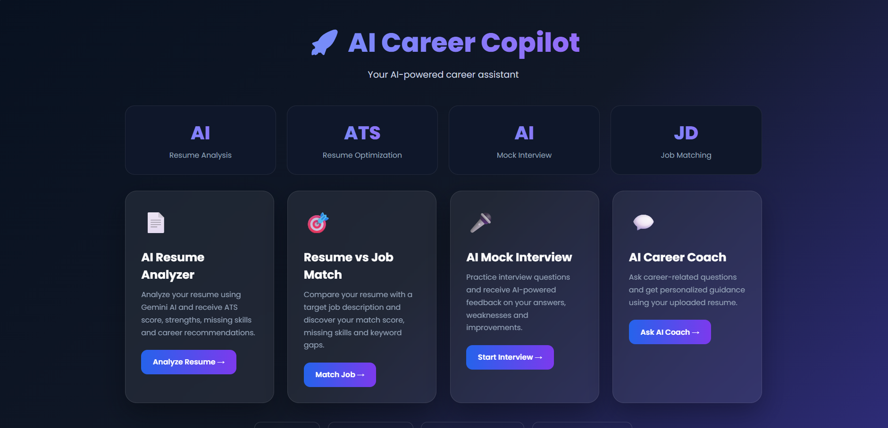
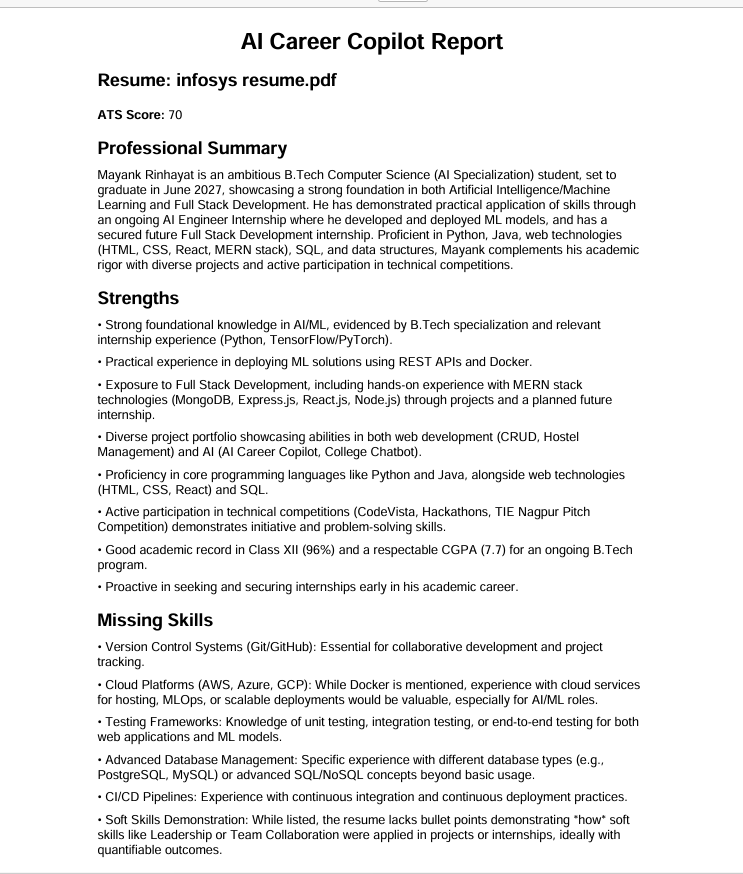

# 🤖 AI Career Copilot

An AI-powered career assistant built with **Python, Flask, and Google Gemini AI**.

AI Career Copilot helps job seekers analyze their resumes, evaluate ATS compatibility, compare resumes with job descriptions, practice interviews, and receive personalized career guidance.

---

## ✨ Features

### 📄 AI Resume Analyzer
- Upload resume in PDF format
- Extract resume content automatically
- Generate AI-powered resume analysis
- ATS score evaluation
- Strengths identification
- Missing skills detection
- Technical skills extraction
- Career recommendations
- Best-fit job roles
- AI-generated interview questions

### 🎯 Resume vs Job Match
Compare your resume with a target Job Description using AI.

- 📊 Match Score
- ✅ Matching Skills
- ❌ Missing Skills
- 🔑 Keyword Gaps
- 🟢 Matched Keywords
- ⭐ Important Keywords
- 📈 Keyword Coverage
- 💡 AI Suggestions

### 🎤 AI Mock Interview
Practice interview questions with an AI interviewer.

- Resume-based interview questions
- Answer evaluation
- Overall score
- Strengths
- Weaknesses
- Better answer suggestions
- Interview improvement feedback

### 💬 AI Career Coach
Ask career-related questions and receive AI-powered guidance based on your uploaded resume.

### 📥 PDF Report
Generate and download a professional PDF report containing the resume analysis and recommendations.

---

## 🖥️ Application Screenshots

### 🏠 Home Page


### 📊 Resume Analysis


### 📈 Dashboard


### 📥 Downloaded Report


---

## 🛠️ Tech Stack

| Technology | Purpose |
|------------|---------|
| Python | Backend development |
| Flask | Web framework |
| Google Gemini AI | AI-powered analysis |
| PyMuPDF | PDF text extraction |
| ReportLab | PDF report generation |
| HTML | Frontend structure |
| CSS | UI and styling |
| JavaScript | Frontend interactions |

---

## 📂 Project Structure

```text
AI-Career-Copilot/
│
├── app.py
├── requirements.txt
├── .env.example
├── README.md
├── .gitignore
│
├── static/
│   ├── css/
│   ├── js/
│   └── images/
│
├── templates/
│   ├── index.html
│   ├── dashboard.html
│   ├── result.html
│   ├── chat.html
│   ├── interview.html
│   ├── mock_interview.html
│   └── job_match.html
│
└── screenshots/
    ├── home.png
    ├── analysis.png
    ├── dashboard.png
    └── download-report.png
